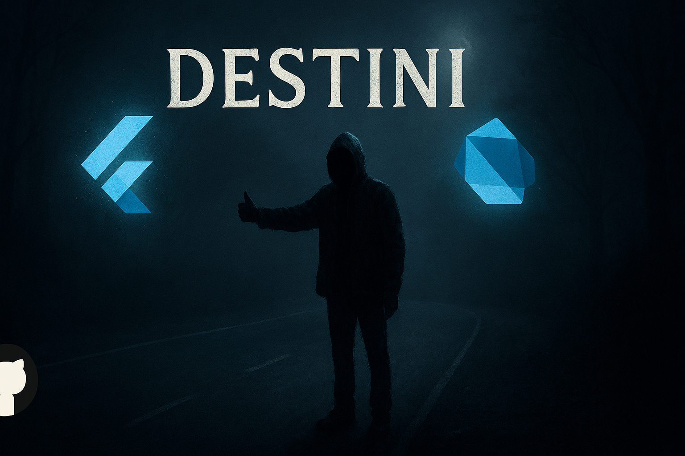
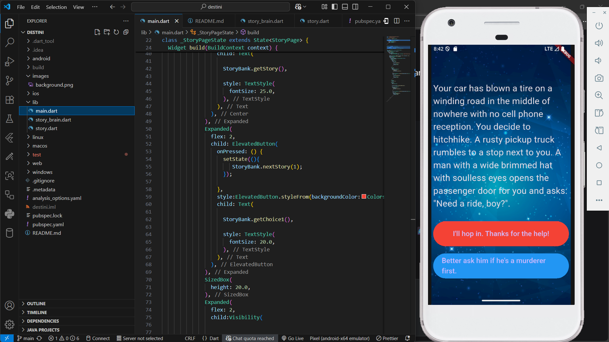

# Destini: Choose Your Own Adventure 🚀



Welcome to **Destini** – an thrilling, interactive storytelling app built with Flutter and Dart! 🌟 Imagine hitchhiking on a dark, winding road where every choice could lead to survival... or doom. 😱 This beginner-friendly project turns a simple choose-your-own-adventure tale into a fully functional mobile app, perfect for learning app development while having fun.

Whether you're a newbie coder or a seasoned dev, Destini showcases core concepts like state management, UI building, and logic branching in a spooky, engaging way. Ready to dive in? Let's make your coding journey epic! 🎮

## 🌟 Why Destini? The Magic Behind the App

Destini isn't just code – it's an adventure! Here's what makes it shine:

- **Interactive Storytelling**: Branching narratives based on user choices, with multiple endings (including hilarious and fatal ones). 📖
- **Flutter-Powered UI**: Beautiful dark theme, responsive buttons, and a mysterious background image for that eerie vibe. 🖼️
- **Simple Yet Powerful Logic**: A "brain" class handles story progression, making it easy to expand with your own tales.
- **Beginner-Friendly**: Clean code structure with classes, methods, and widgets explained in detail – ideal for learning Dart and Flutter.
- **Cross-Platform**: Runs on iOS, Android, web, or desktop with a single codebase. 📱💻

This project was inspired by classic adventure books, but digitized for modern devs. It's small (just 3 files!), yet teaches big lessons in app architecture. Perfect for portfolios, tutorials, or just hacking around! 🔧

## 📸 Screenshot Spotlight

Here's a glimpse of Destini in action – the starting screen where the hitchhiking horror begins:



(Pro Tip: Tap those buttons wisely... or not! 😂)

## 🛠️ Installation & Setup

Getting Destini up and running is a breeze. Follow these steps to embark on your adventure:

1. **Prerequisites**:
   - Install [Flutter SDK](https://flutter.dev/docs/get-started/install) (version 3.0+ recommended).
   - Have Dart installed (comes with Flutter).
   - An emulator or physical device for testing.

2. **Clone the Repo**:
   ```
   git clone https://github.com/Yoni-Berihun/destini.git
   cd destini
   ```

3. **Install Dependencies**:
   ```
   flutter pub get
   ```

4. **Run the App**:
   ```
   flutter run
   ```
   Boom! The app launches with the first story. Choose wisely... or restart endlessly. 🔄

If you encounter issues, ensure your `pubspec.yaml` includes the asset for `images/background.png` (a mysterious road image – feel free to swap it!).

## 🎮 How to Play & Use

- **Start the Adventure**: Launch the app to see the initial story.
- **Make Choices**: Tap the red button for Choice 1 (risky?) or blue for Choice 2 (safe?).
- **Reach Endings**: Paths lead to 3 possible finales – bond with a killer, crash dramatically, or cop out safely.
- **Restart**: At any ending, tap "Restart" to loop back.
- **Customize**: Edit `story_brain.dart` to add your own stories, choices, or even more branches!

Example Flow:
- Story 0: Hitchhike? → Choice 1: Hop in → Story 2: Glovebox horror → Choice 2: Stab him → Epic crash ending! 💥

## 🔍 Code Breakdown: A Deep Dive for Learners

Destini is structured for clarity. Here's a quick tour:

- **`story.dart`**: Defines the `Story` class – a blueprint for each story page with title and choices. Uses `final` variables for immutability. 🏗️
- **`story_brain.dart`**: The app's "brain"! Manages a list of stories, tracks progress with `_storyNumber`, and branches logic in `nextStory()`. Includes getters for UI and visibility checks. 🧠
- **`main.dart`**: Builds the UI with Flutter widgets. Uses `StatefulWidget` for dynamic updates, buttons for choices, and a dark theme for atmosphere. 📱

Key Concepts Demonstrated:
- **Constructors**: Named parameters with `required` for safe object creation.
- **State Management**: `setState()` refreshes the screen on choice.
- **Conditionals**: Nested `if-else` for story branching.
- **Visibility**: Hides buttons at endings for clean UX.


## 🚀 Future Enhancements & Contributions

Want to level up Destini?
- Add more stories or multimedia (sounds, images per page).
- Implement saving progress with shared preferences.
- Theme switching or localization for global adventures.

Contributions welcome! Fork the repo, create a branch, and submit a PR. Let's collaborate! 🤝

- **Issues**: Report bugs [here](https://github.com/yourusername/destini/issues).
- **License**: MIT – free to use, modify, and share.

## 🙌 Acknowledgments

Shoutout to Flutter community, choose-your-own-adventure pioneers, and you for checking this out! Inspired by simple games that spark imagination. ❤️

Connect with me on LinkedIn for more dev tips and projects:


Thanks for exploring Destini – may your choices lead to awesome code! 🌌